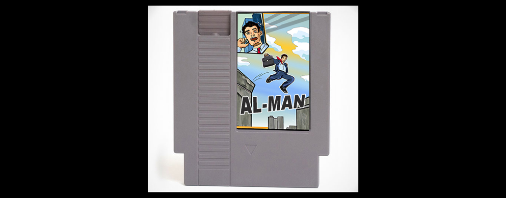

# AL-MAN

### AL-MAN is a HTML5 video game built with Tiled, Quintus JavaScript library and 2D Modules.

| Exercises     | Sets     | Reps  |
| ------------- |:--------:| -----:|
| KB Swings     | 3        | 20    |
| Goblet Squat  | 3        | 10    |
| Bent-Over Row | 3        | 12    |

### This project is my first video game. 
