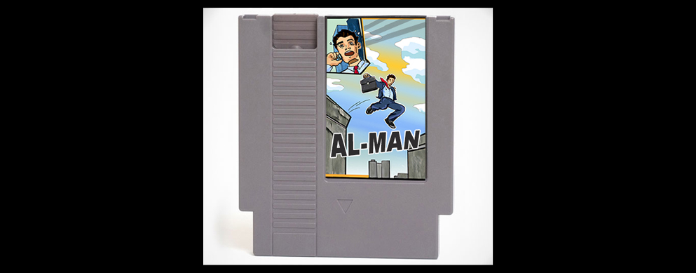
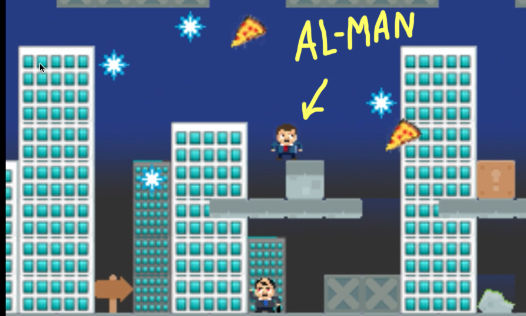
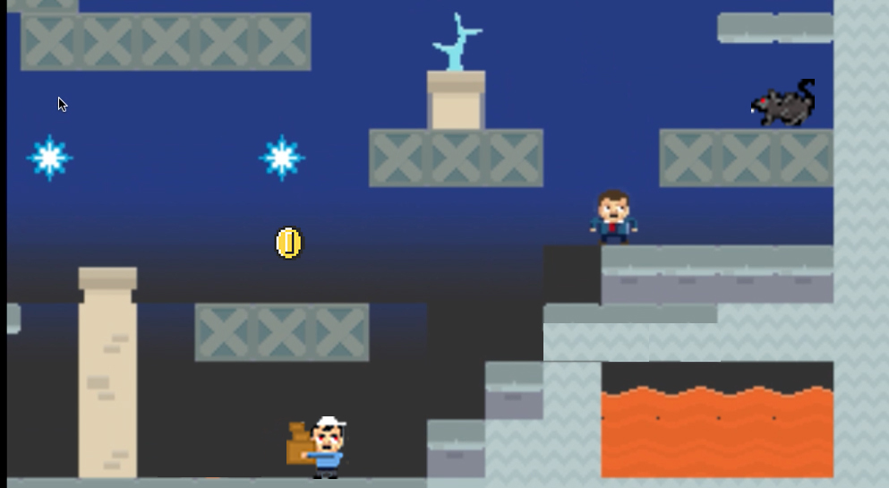

# Welcome to AL-MAN the video game! 
### *can you survive the 9 to 5?*

## Game Objective
### Guide your hero through the busy streets of New York at rush hour dodging pedestrians and urban wildlife. Coins and pizza slices will give you strength for the stressful commute. Pop into the museum for a break from the daily grind, but watch out for zombie tourists lurking on every floor! Don't stop moving or you might become a zombie yourself...

>Screenshot from "Big Apple 3 AM" level.

>Another screenshot from the same level.

## Game Design
### AL-MAN is an HTML5 2D Platform Game so no need to download the game just visit the site and you can start playing. The video game built with Node, Express, Tiled for the graphics, Quintus JavaScript library and its 2D Modules for the game physics. Original artwork and level design, including the game cartridge.

### Game Overview
| Levels        | Skill          | Coins  |
| ------------- |:--------------:| ------:|
| Big Apple 3 AM| Easy           | 5      |
| MoMA Zombies  | Medium         | 10     |
| 5th Ave Rush  | Impossibly Hard| 20     |

## Special thanks to Zenva Academy for its intro to game design course, Zenva.com for tutorials and courses.
